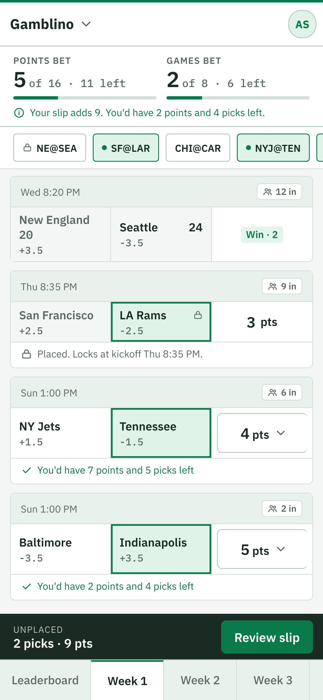
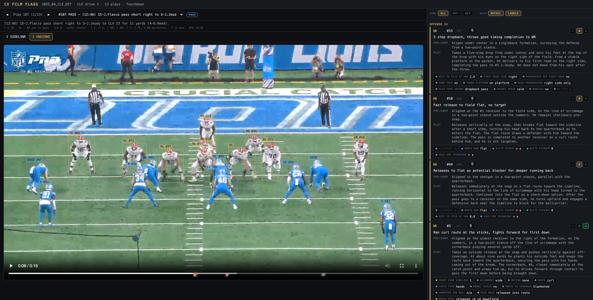
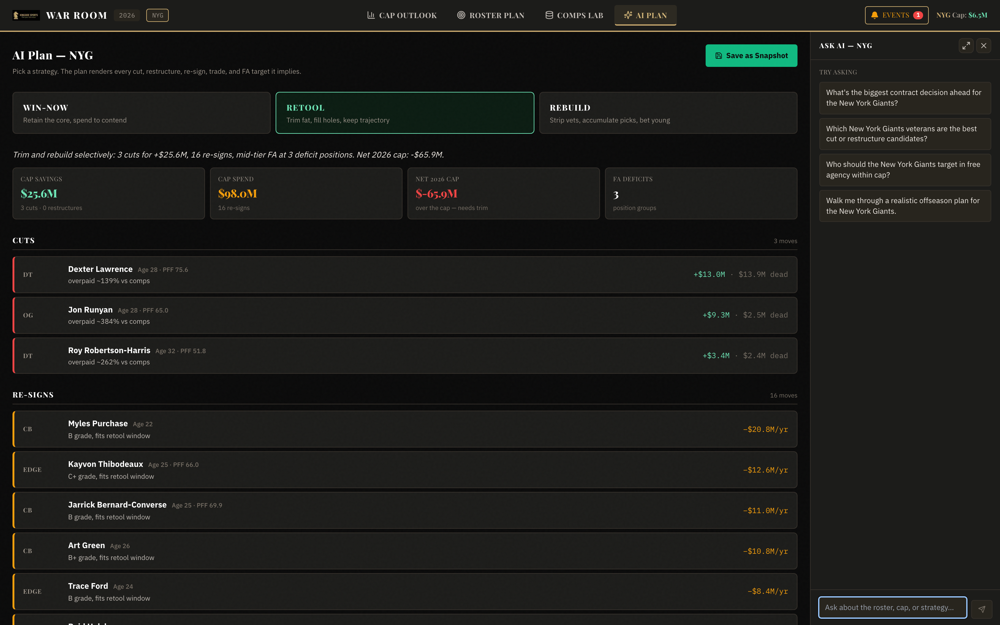

# AI Portfolio — Anthony Spadafino

**Contact:** anthony.spadafino@gmail.com

Three production-grade sports-intelligence platforms I designed and built end-to-end. Each pairs
a modern web stack with applied AI — LLM systems, computer vision, and classical ML — against
real, messy sports data, with the evaluation discipline to know when the models are actually
right.

> **Note:** the source code for all three projects is private and proprietary. This repository
> contains write-ups and screenshots only — see [NOTICE.md](NOTICE.md).

---

## 🎲 [Gamblino](gamblino/) — social sports gaming

A social sports gaming league for friends — points, not money — live in production at
[gamblino.life](https://gamblino.life) with a real 29-player league. Weekly 16-point budgets
against the spread, perfect-week and near-miss bonuses, playoff confidence pools, and a
spreadsheet-homage design system. Its standout AI feature: league admins write scoring rules
in plain English, an LLM compiles them into a whitelisted JSON DSL, and no rule runs until it
passes a scenario test suite — after which a pure, deterministic engine executes it.

**ML surface area:** NL→DSL rule compilation with a generate-and-check loop · scenario-gated
activation with frozen rule hashes · deterministic zero-dependency execution · historical
replay to evaluate candidate rules against whole past seasons.

---

## 🏈 [Game Plan](game-plan/) — NFL play-by-play intelligence platform

Ask questions in plain English; an LLM compiles them to SQL; DuckDB-WASM executes them
**entirely in the browser** against three seasons of play-by-play data, and a second model pass
writes the analyst takeaways. Behind it: a multi-stage computer-vision pipeline over real
coaches film — detection, tracking, cross-camera association by field geometry, CNN position
identification, and VLM-graded per-player evaluations, all gated by calibrated QA before
anything ships.

**ML surface area:** schema-grounded NL→SQL compilation · LLM result analysis · YOLOv8 + SAM2
detection/tracking · projective-geometry cross-angle matching · CNN position classifier trained
on a provenance-tracked human GT corpus · VLM action grading with deterministic QA gates ·
golden-test evaluation harness for the LLM layer itself.

---

## 📈 [Sports-Bet](sports-bet/) — odds-movement analysis & ML signal detection

A live market-microstructure study of sports betting lines: hourly odds snapshots across nine
leagues, 40+ engineered movement features per game, per-sport statistical hypothesis testing
(p-values and effect sizes, not vibes), and four model families trained per sport × target —
validated exclusively by walk-forward backtesting so no model ever sees the future.

**ML surface area:** time-series feature engineering · per-sport hypothesis tests · LogReg /
Random Forest / GBM / XGBoost with cross-validated model selection and feature-importance
reporting · walk-forward validation · confidence-scored live signals with post-hoc outcome
grading · a KenPom-efficiency March Madness ATS predictor.

---

## 🏛️ [War Room](war-room/) — decision intelligence for NFL front offices

"A Bloomberg terminal for NFL front offices." Every roster is a portfolio: each contract
carries a cost basis, a comp-derived market value, and a live surplus. A quantitative valuation
engine prices players off a 4,000+ contract/trade comps database; an LLM planning layer turns a
chosen strategy (Win-Now / Retool / Rebuild) into concrete moves — every one validated by a
deterministic salary-cap engine before it's shown.

**ML surface area:** comps-based market-valuation model with age/term adjustments ·
cap-share-vs-win-share allocation efficiency scoring · LLM plan generation constrained by exact
cap math · a context-injected AI analyst grounded in the team's live financial state.

---

## Shared engineering DNA

- **Stack:** Next.js (App Router) · TypeScript (strict) · Tailwind · Zustand · Recharts · Python (FastAPI, pandas, scikit-learn, xgboost)
- **AI:** Anthropic Claude APIs · Gemini VLM labeling · YOLOv8/SAM2 CV · Deepgram speech-to-text
- **Data engineering:** DuckDB (WASM in-browser + node) · parquet pipelines · Azure SQL · Vercel Blob
- **Evaluation culture:** tiered acceptance suites (unit → DB integration → LLM golden tests →
  E2E) · walk-forward backtests · QA gates calibrated against human-authored negative controls ·
  provenance on every piece of ground truth

---

*Code is proprietary — see [NOTICE.md](NOTICE.md). Screenshots and text shared for evaluation purposes only.*
