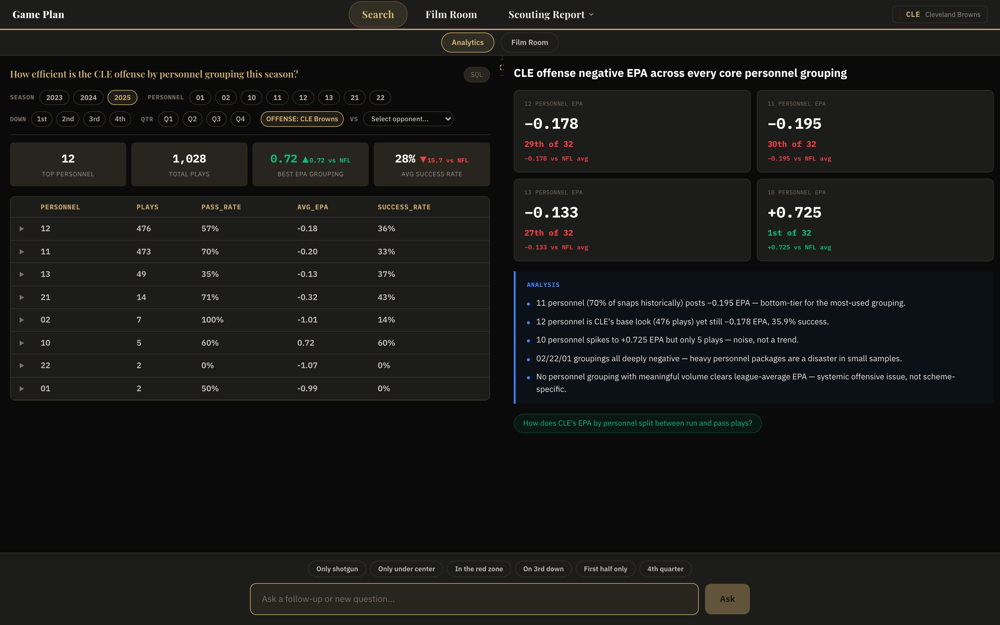
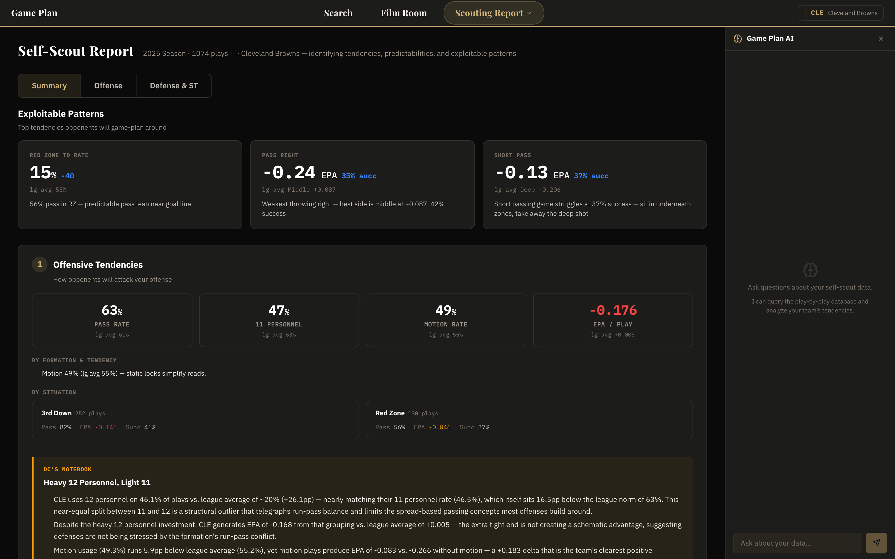
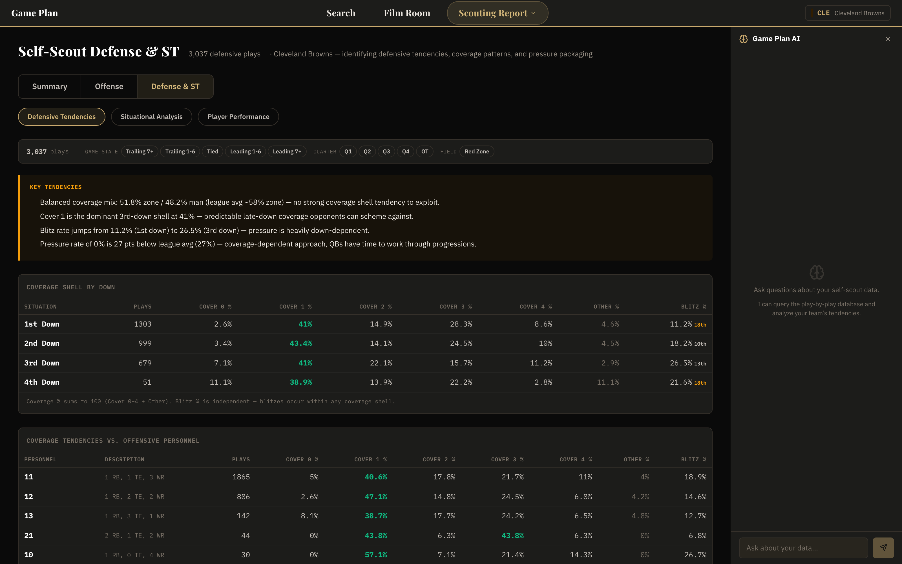
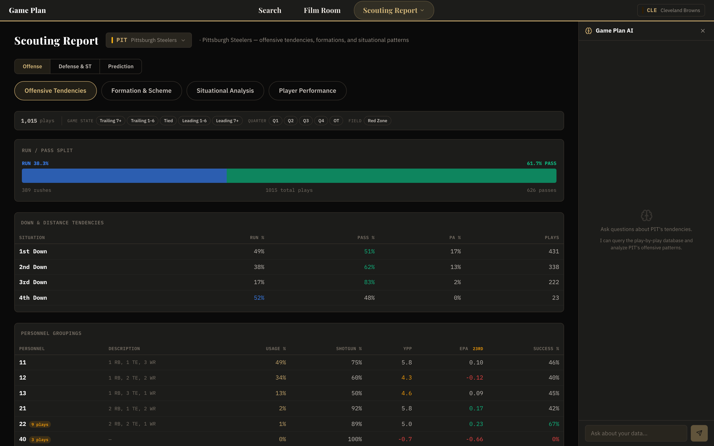
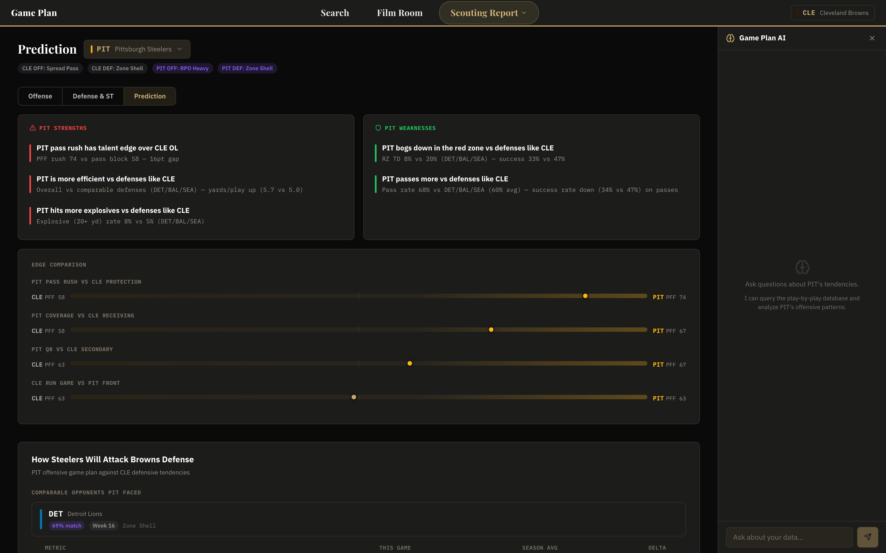
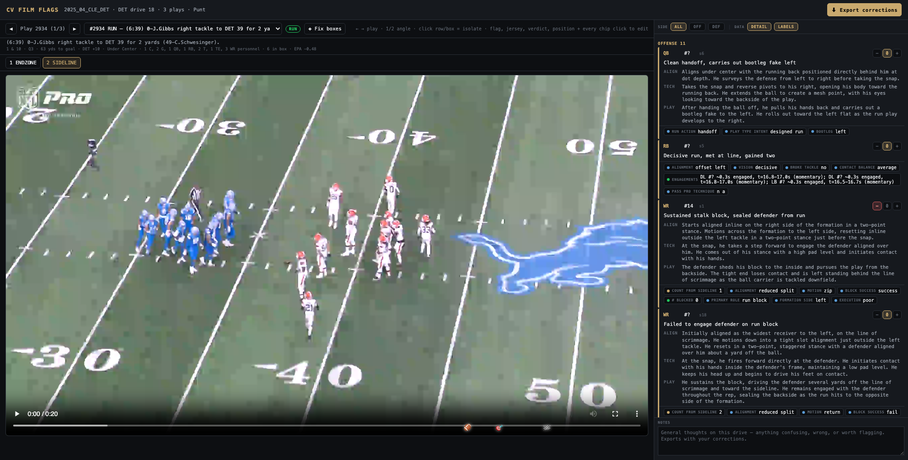
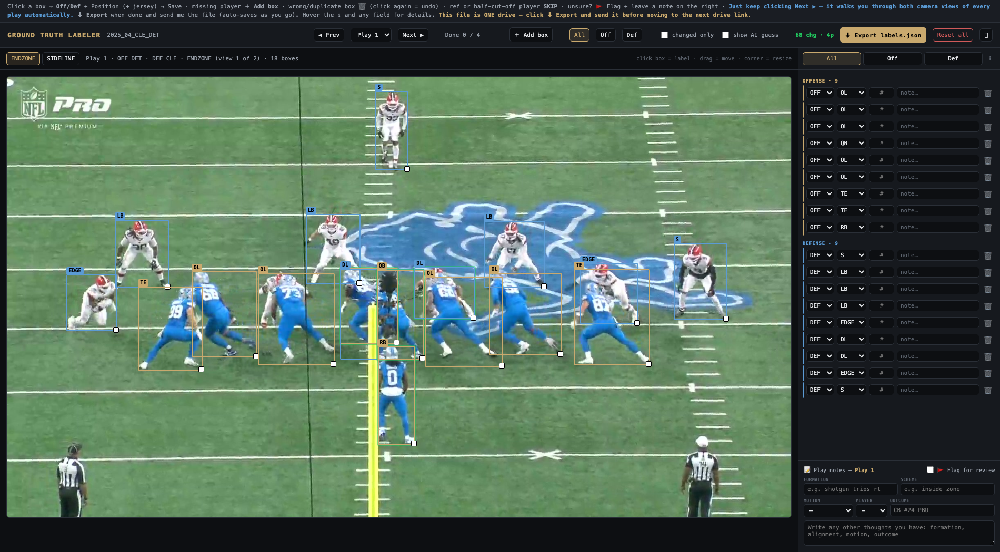

# Game Plan — NFL Play-by-Play Intelligence Platform

**Ask football questions in plain English. Get analyst-grade answers — tables, stat cards, and
LLM analysis — computed entirely in your browser.**

Game Plan is a full NFL analytics workbench covering the 2023–2025 seasons: natural-language
querying, offensive & defensive self-scouting, opponent scouting reports with matchup
prediction, and a Film Room built on real coaches film with a computer-vision pipeline that
tracks and grades every player on every play.

---

## 1 · Natural-language analytics — a compiler, not a chatbot



*One question — "How efficient is the CLE offense by personnel grouping this season?" — becomes
a validated SQL query, an interactive filter state (season / personnel / down / quarter /
opponent), a drill-downable results table, ranked stat cards, and an LLM-written analysis with
suggested follow-ups.*

The NL layer is architected as a **compilation pipeline with guardrails**, not a free-form chat:

- **Schema-grounded generation.** The LLM writes SQL against a documented schema, steered by a
  few-shot example library that is itself *generated offline* by a larger model and versioned —
  prompt quality is a build artifact, not folklore.
- **Deterministic post-processing.** A SQL rewriter folds the UI's filter state into the
  generated query as pure, unit-tested functions — the interactive filter pills, drill-downs,
  and breadcrumbs all round-trip through the same rewriter, so UI state and SQL can never
  disagree.
- **In-browser OLAP.** DuckDB-WASM executes over columnar parquet in the page. After initial
  load, query latency is client-side only and raw data never leaves the browser.
- **Second-pass analysis.** A separate LLM call reads the *result set* (not the question) and
  writes the takeaways panel — league-ranked context, caveats on small samples, and follow-up
  questions that re-enter the compile loop.
- **Latency-aware model routing.** Interactive routes run on a fast frontier model with
  thinking disabled; offline generators (self-scout reports, the few-shot library) run on a
  larger model with adaptive reasoning. Cost and latency are engineering parameters, not
  accidents.

**And it's tested like a compiler:** an opt-in golden-test tier runs a fixed corpus of NL
questions through the live model and scores the SQL against expected results, so prompt or
model regressions are caught in CI — plus data-consistency evals over the parquet itself.

## 2 · Self-scout — how opponents will attack you

| Offense | Defense |
|---|---|
|  |  |

Season-long tendency reports for every team: exploitable patterns, situational splits, coverage
shells by down, blitz rates vs. personnel — each section paired with generated "coach's
notebook" insights that read like a coordinator's film notes. The narrative layer is regenerated
offline against fresh aggregates for all 32 teams, so the prose always matches the numbers
underneath it.

## 3 · Opponent scouting + matchup prediction

| Scouting report | Prediction |
|---|---|
|  |  |

The prediction view is a small similarity engine: it retrieves the opponents your upcoming rival
has already faced that most resemble your team's defensive identity, then projects strengths,
weaknesses, and likely game-plan from those comparable matchups — every claim traceable to the
plays it came from.

## 4 · Film Room — a multi-stage CV pipeline over real coaches film

Game Plan ingests licensed NFL+ coaches film (endzone + sideline all-22 angles, full 2025
season) through an internal pipeline, then runs a staged perception stack:

```
raw all-22 clips (two synchronized camera angles per play)
   │
   ▼
[1] Detection — YOLOv8 person detection, filtered by a learned field-region
    mask that rejects sideline/bench/crowd false positives
   │
   ▼
[2] Tracking — per-player tracks built with SAM2 propagation from each
    player's set-point, so identity survives the pile
   │
   ▼
[3] Cross-angle association — endzone ↔ sideline tracks matched by
    projective field geometry, giving one canonical roster per play
    (labels are view-invariant by construction)
   │
   ▼
[4] Identity & position — CNN position classifier + OCR jersey reads,
    reconciled against charted participation data; every player resolved
    to a position, side, and slot
   │
   ▼
[5] Action grading — a VLM grades each tracked player's rep (pass-set
    result, run fit, route, coverage) and writes scouting-style prose
   │
   ▼
[6] QA gates — deterministic checks over every generated label and
    sentence before anything ships
```

Two disciplines make this trustworthy rather than demo-ware:

- **A human ground-truth program with provenance.** Position and action labels are backed by an
  internally built GT corpus — stratified sampling, drive-sliced labeler assignments, conflict
  gates between labelers, and browser review tools (below) where a human adjudicates every
  model disagreement. Every correction records who made it, when, and what it replaced;
  human-confirmed fields are protected from automated writers.
- **Calibrated QA, not vibes.** Every automated quality check is measured against
  human-authored text as a negative control before its counts are trusted — a check that flags
  human-written GT is a broken check, not a defect list. Model changes are evaluated on a held
  eval set, and negative results are recorded in an experiment ledger so failed ideas stay
  failed.

| Per-player flag review tooling | Position labeling studio |
|---|---|
|  |  |

*Internal tools from the CV program: left — a grader adjudicates VLM-written per-player
evaluations against the film; right — the ground-truth labeler with per-play bounding boxes,
position assignments, and dual camera views.*

The result surfaces in-app: film clips attached to query results, natural-language film search
("red zone motion runs"), user-built cutups, and a per-player ACTIONS view over every graded
play.

## Engineering notes

- **Stack:** Next.js 15 (App Router) + TypeScript strict · Tailwind + custom design system ·
  Zustand · Recharts · DuckDB-WASM · Vercel
- **AI:** Claude (NL→SQL, chat, analysis, insight generation) · Gemini VLM (film labeling) ·
  YOLOv8 + SAM2 (detection/tracking) · CNN position ID · Deepgram (voice notes)
- **Testing:** five-tier acceptance suite — pure-logic unit tests, DuckDB integration against
  the real parquet, NL→SQL golden tests against the live model, data-consistency evals, and
  Playwright E2E. Every bug fix lands with a test that fails on the un-fixed code.

---

*The Game Plan codebase is proprietary — © Anthony Spadafino, all rights reserved. Screenshots
and text shared for evaluation purposes only. Play-by-play data from nflverse; film via licensed
NFL+ subscription. See the repository [NOTICE](../NOTICE.md).*
