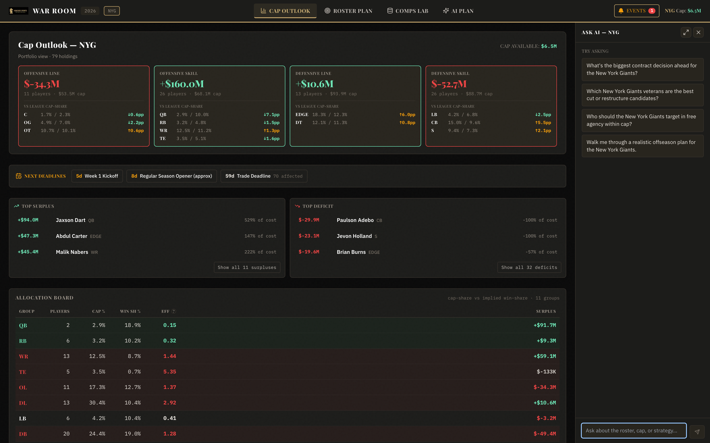
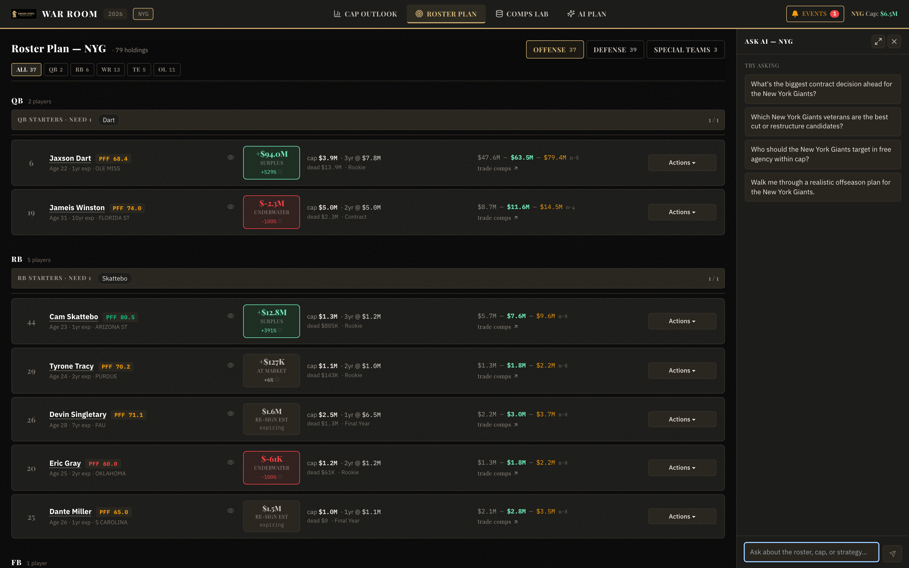
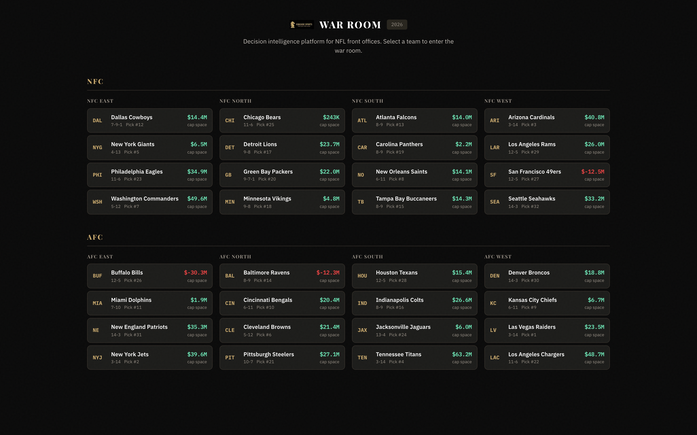
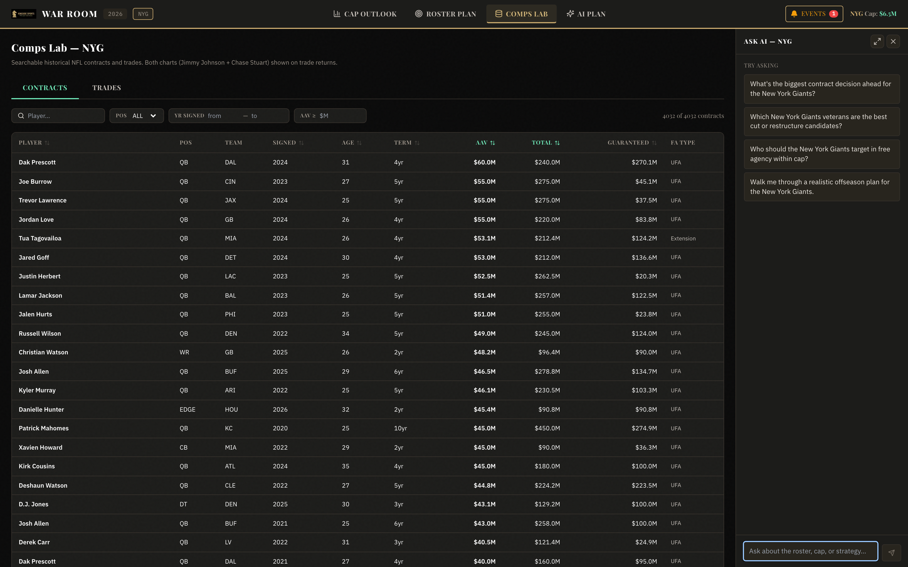

# War Room — Decision Intelligence for NFL Front Offices

**A Bloomberg terminal for the NFL. The roster is a portfolio; every contract is a position with
a cost basis, a market value, and a live unrealized surplus.**

War Room reframes roster construction through an investment lens: rookie deals are options,
restructures are refinancing, trades are asset swaps, cuts are realized losses. Comp data —
thousands of historical contracts and trades — plays the role of the market tape that prices
every new transaction. Supports all 32 teams via dynamic routing.

## The valuation engine

The quantitative core prices every player like an asset:

- **Cost basis** — the contract's real cap commitment, modeled with NFL cap mechanics
  (signing-bonus proration, dead money, June 1 designations, guarantee structures).
- **Market value** — projected from comparable contracts retrieved out of a 4,000+
  contract/trade database, adjusted for term and the player's position on the aging curve, with
  the comp set shown for every valuation (n disclosed — no black-box numbers).
- **Surplus** — market value minus cost basis, rolled up from player → position group → unit →
  roster, so a GM sees exactly where the portfolio is over- and under-allocated.
- **Allocation efficiency** — each position group's share of cap is compared against its
  implied share of wins, flagging groups that consume budget without buying production.
- **Trade pricing** — draft-pick trades are charted on both the Jimmy Johnson and Chase Stuart
  value curves, because reasonable front offices disagree about which market is real.

## Cap Outlook — the portfolio view

*79 holdings grouped by unit: cap-share vs. league benchmarks per position, top
surplus/deficit holdings priced against comps, deadline tracking, and the allocation board
comparing each group's cap share to its implied win share.*

## Roster Plan — every player priced like an asset

*Each player carries a grade, cap number, dead money, a comp-projected market range with its
comp count, and a surplus/underwater badge — with per-player actions (cut, restructure, trade,
re-sign) that flow real cap math through the plan.*

## AI Plan — LLM strategy, deterministic accounting

*Pick Win-Now, Retool, or Rebuild. The system materializes the strategy as an actual set of
moves — cuts with dead-money math, re-signs at comp-projected AAVs, free-agent targets at
deficit positions — totaled into net cap impact and saveable as a comparable snapshot.*

The architecture here is deliberate: **the LLM proposes, the cap engine disposes.** Strategy
generation is a language-model problem (which veterans fit a retool window, which deficits to
address in free agency), but every proposed move is priced and validated by the same
deterministic cap engine that powers manual planning — so a generated plan can be wrong about
football, but never about the math. Plans are materialized as first-class objects: saveable,
diffable, and comparable side by side.

## Ask AI — an analyst on every screen

A persistent, team-context-aware Claude panel rides alongside every view: "What's the biggest
contract decision ahead?", "Which veterans are the best cut or restructure candidates?", "Walk
me through a realistic offseason plan." Each conversation is grounded by injecting the team's
live financial state — cap sheet, roster grades, surplus table, comp retrievals — and supports
structured output modes (narrative or chart) so answers can render as visuals, not just prose.

## Comps Lab — the market-data terminal

*4,000+ historical contracts and trades, searchable and sortable by position, year, AAV, total,
and guarantees — the pricing backbone for every valuation in the app.*

## Engineering notes

- **Stack:** Next.js (App Router) · TypeScript strict · Tailwind · Zustand slice-pattern store
  with team-scoped persistence · Vercel-ready
- **AI:** Anthropic Claude, server-side, with full team-context injection and structured
  chart/narrative output modes
- **Data:** static JSON snapshots generated by a Python normalization pipeline (cap data,
  rosters, comps, draft capital), schema-designed to swap to live PostgreSQL without app changes

---

*The War Room codebase is proprietary — © Anthony Spadafino, all rights reserved. Screenshots
and text shared for evaluation purposes only. Cap and contract figures are prototype data
informed by public sources. See the repository [NOTICE](../NOTICE.md).*
